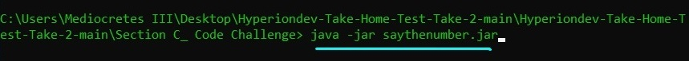
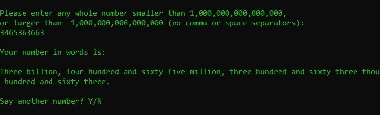

# How to run the JAR file via CMD

### Note: make sure you have JAVA or a JRE installed before attempting these steps.

* Onve you have located the JAR file in the extraced repo folder, open a command terminal. Here Windows Command Prompt is used, but the commands will work the same for Linux or MacOS.

* Next, locate copy the path to Section C of the repo folder.
* Right click and copy it:

* In the CMD terminal type <code>cd</code> followed by a space, and past the path you just copied:

* Then, type the command <code>java -jar myjarfilename.jar</code> and press Enter:

And thats it! You should see the main program running in the terminal:

