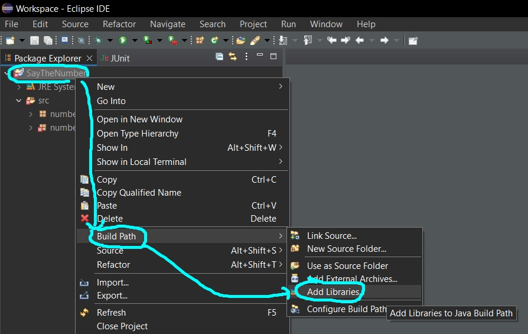

# How to install Java and Eclipse

## How to install Java

* Go to [java.com/en/download].
* Click **"Agree and Start Free Download"**:


* Save file in prefferred location:


* Run the **.exe** file (double click on it) and click **"Yes"**.
* Tick the **"Change destination folder"** box, click **"Install"**, and wait for installation:


* You have successfully installed Java should display after install. Click **"Close"**:


 	
* To check installation, open **Command Prompt**:


* Type the following command and press Enter:

```
java -version
```

* The current version should be displayed:


## How to install Eclipse

To run Java, you need an [**IDE**], we reccommend **Eclipse**.

* Go to [**eclipse.org/downloads**].
* Click "Download":


* Select Get Eclipse IDE 2021-03 and click **"Download x86_64"**:


* Save file to preferred location:


	
* Run the **.exe** file (double click on it) - **eclipseinstaller** should display.

* Select **"Eclipse IDE for Java Developers"**:


* Choose your destination folder and click **"Install"**:


* Click **"Accept now"** on the **User Agreement**:


* Wait for installation and click **"Launch"**:


* Choose your destination folder for Eclipse workspace (this will store all your Java projects) and click **"Launch"**:


* Eclipse Welcome screen should be displayed:


## How to run the program in Eclipse

* Select **"File > New>Java Project"**:


* Enter the new project name:


* If you are asked to enter **New module-info**, select **Don't Create**:



* If you are asked to **Open Associated Perspective?** just click "No":


* If you don't see the **Package Explorer** view, select the small **"J"** icon to the right and close **welcome** tab.
* You should see the created folder in the **Package Explorer**.
* Next, expand your new folder, and right-click on the **src** folder.
* Then right-click on **New** and select **Package**:


* Name the package **numberSayer** - THIS IS VERY IMPORTANT:


* Now, go to where you saved the repo contents, navigate to the **numberSayer** folder, and copy all three **.java** files:


	
* Paste them directly into the **numberSayer** package you created earlier. 
* You should see red warning icons.
* Open the **NumberSayerTest.java** class.
* Then hover your mouse over the red line at **org.junit**:


* You should see a popup **The import org.junit cannot be resolved**.
* Click **Fix project setup**:


* Next add **Junit 5** to your project's build path:


* You should now see that the red warning icons have disappeared.
* You can now run the code by opening the **Main.java** class and selecting the green play icon **Run**:


* You can also run the test file by going back to the **NumberSayerTest.java** tab and selecting **Run**.

And that's it! You're all set up!
